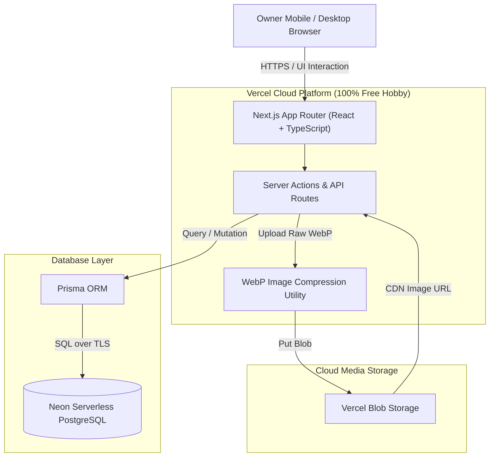
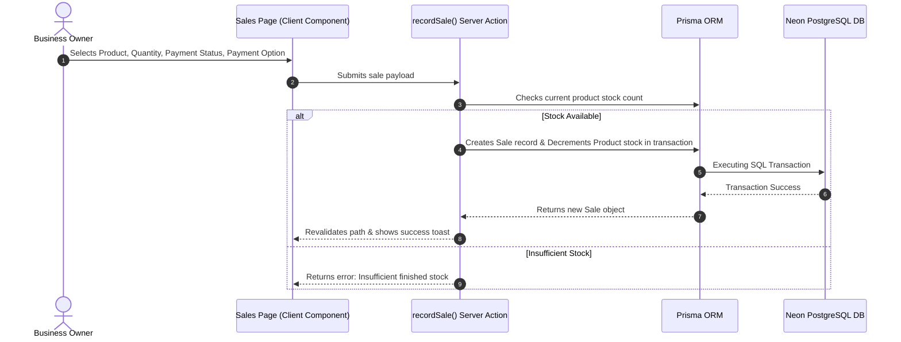
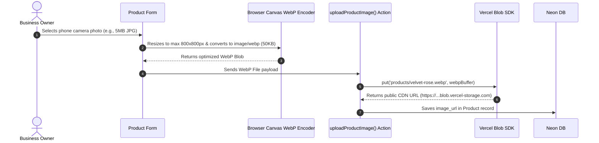
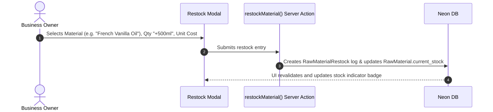

# System Architecture Document

## System Overview: Invento Architecture

**Invento** is built as a serverless, cloud-native web application deployed on **Vercel** with a **Neon PostgreSQL** database layer and **Vercel Blob** cloud file storage.



---

## 1. Tech Stack Components

| Layer | Component | Description |
| :--- | :--- | :--- |
| **Frontend UI** | **Next.js 14/15 (React 18/19)** | App Router, React Server Components (RSC), Client Components for forms & interactive modals. |
| **Styling** | **Tailwind CSS + Lucide Icons** | Utility-first CSS with modern color palette, badged statuses, and responsive mobile-first grids. |
| **Backend & API** | **Next.js Server Actions** | Type-safe server mutations without external REST overhead. |
| **Database ORM** | **Prisma ORM** | Schema-driven ORM generating type-safe TypeScript clients. |
| **Database** | **Neon PostgreSQL** | Serverless cloud Postgres instance connected via pooled connection strings (`DATABASE_URL`). |
| **Media Storage** | **Vercel Blob (`@vercel/blob`)** | Cloud storage for perfume product images. |
| **Image Optimizer** | **Canvas / WebP Converter** | Converts user-uploaded images to lightweight `.webp` (< 100 KB) before uploading to Vercel Blob. |

---

## 2. Component Layering & Data Flow

### A. Customer Sale Flow


### B. Image Upload & WebP Optimization Flow


### C. Raw Material Restock Flow


---

## 3. Directory & File Structure

```
g:/Projects/invento/
├── app/
│   ├── layout.tsx            # Global layout with navigation bar
│   ├── page.tsx              # Dashboard Home (Metrics, Revenue, Alerts)
│   ├── products/
│   │   └── page.tsx          # Products Manager (Grid, Add/Edit Perfume Modal)
│   ├── sales/
│   │   └── page.tsx          # Customer Sales Register (Filterable table, Record Sale Modal)
│   ├── raw-materials/
│   │   └── page.tsx          # Raw Materials Hub (Oils, Bottles, Packaging, Restock Intake)
│   └── api/
│       └── upload/route.ts   # Image upload endpoint with WebP processing
├── components/
│   ├── ui/                   # Buttons, Badges, Modals, Cards, Inputs
│   ├── Navbar.tsx            # Top/Bottom mobile navigation bar
│   ├── DashboardMetrics.tsx  # Revenue & Pending stats
│   ├── ProductCard.tsx       # Perfume display card with stock status
│   ├── SalesTable.tsx        # Filterable orders table
│   └── RestockModal.tsx      # Raw material intake form
├── lib/
│   ├── prisma.ts             # Prisma client singleton
│   ├── webp-compressor.ts    # WebP image compression helper
│   └── utils.ts              # Currency & date formatters
├── prisma/
│   └── schema.prisma         # PostgreSQL schema definition
├── public/                   # Static assets & placeholders
├── PRD.md                    # Product Requirements Document
├── architecture.md           # System Architecture Document
├── database.md               # Database Schema Document
└── plan.md                   # Development & Testing Plan
```
