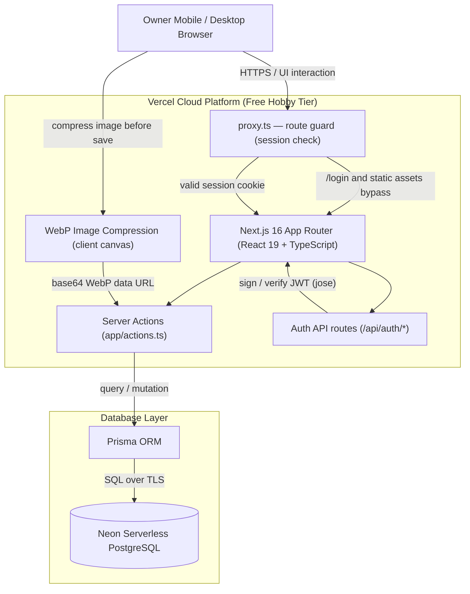
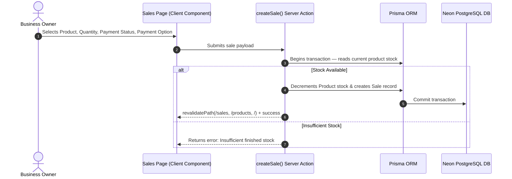
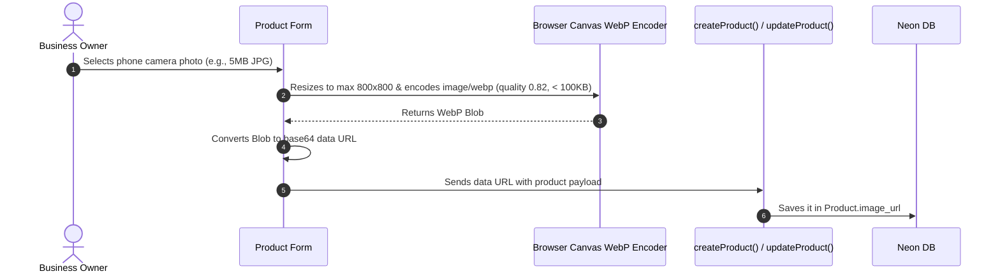
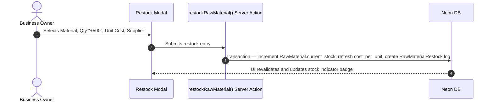

# System Architecture Document

## System Overview: Invento Architecture

**Invento** is built as a serverless, cloud-native web application deployed on **Vercel** with a **Neon PostgreSQL** database layer. All mutations go through Next.js Server Actions backed by Prisma transactions.



---

## 1. Tech Stack Components

| Layer | Component | Description |
| :--- | :--- | :--- |
| **Framework** | **Next.js 16 (App Router, Turbopack)** | Server Components for the dashboard/finances, Client Components for interactive forms & modals, Server Actions for mutations. |
| **Route Guard** | **`proxy.ts`** | Next.js 16 request interceptor (middleware replacement) verifying the session cookie on every route. |
| **Frontend UI** | **React 19 + TypeScript** | Client-side pages with optimistic local state around Server Action calls. |
| **Styling** | **Tailwind CSS v4 + lucide-react** | Geist design tokens defined in `app/globals.css` (`@theme`), light/dark variants, responsive mobile-first grids. |
| **Backend & API** | **Next.js Server Actions** | Type-safe mutations in `app/actions.ts`, wrapped in `prisma.$transaction` where stock consistency matters. |
| **Auth** | **`jose` (HS256 JWT) + SHA-256 hashes** | Credentials compared timing-safely against `.env`; sessions live in an `httpOnly` cookie (7 days). |
| **Database ORM** | **Prisma ORM** | Schema-driven, type-safe client; singleton in `lib/prisma.ts`. |
| **Database** | **Neon PostgreSQL** | Serverless cloud Postgres via pooled `DATABASE_URL`. |
| **Image Optimizer** | **Canvas → WebP (`lib/webp-compressor.ts`)** | Client-side resize to ≤ 800×800 and WebP encode (< 100 KB) before saving the data URL on the product record. |
| **Fonts** | **Geist Sans / Geist Mono** | Loaded via `next/font/google` in the root layout. |

---

## 2. Component Layering & Data Flow

### A. Customer Sale Flow


Editing a sale (`updateSale`) re-balances stock inside a transaction: same-product edits apply the quantity delta, product switches restore the old product's stock and deduct from the new one.

### B. Image Upload & WebP Optimization Flow


> Note: `@vercel/blob` is installed and `BLOB_READ_WRITE_TOKEN` is documented in `.env.example`, but current code stores the compressed WebP as a data URL on the product row. Migrating to Blob storage is a planned optimization (keeps rows small and serves images from a CDN).

### C. Raw Material Restock Flow


### D. Batch Production (V2) + Maceration Flow
```mermaid
sequenceDiagram
    autonumber
    actor Owner as Business Owner
    participant UI as Production Page (Client)
    participant Action as produceBatchV2() Server Action
    participant DB as Neon DB

    Owner->>UI: Chooses bottle/mass mode, quantity, concentration, materials, maceration days
    UI->>UI: Live-calculates oil (g) & ethanol (ml); blocks if any material is short
    UI->>Action: Submits production payload
    Action->>DB: Transaction — verify & deduct oil/ethanol (+ optional bottle/box/sticker)
    alt Maceration days > 0
        Action->>DB: Create MacerationBatch (MACERATING) — stock NOT incremented
    else No maceration
        Action->>DB: Increment Product.stock directly
    end
    Action->>DB: Write BatchProduction log
    DB-->>UI: Revalidate /products, /raw-materials, /maceration, /
```

Releasing an aged batch (`addMacerationToStock`) increments `Product.stock` and flips the batch to `ADDED_TO_STOCK`; `extendMaceration` pushes the end date out instead.

### E. Authentication Flow
```mermaid
sequenceDiagram
    autonumber
    actor Owner as Business Owner
    participant Login as /login Page
    participant API as /api/auth/login
    participant Guard as proxy.ts
    participant App as Protected Pages

    Owner->>Login: Enters username + password
    Login->>API: POST credentials
    API->>API: SHA-256 hash + timing-safe compare against .env
    API-->>Login: Sets httpOnly invento-session cookie (HS256 JWT, 7 days)
    Login->>App: Redirect to /
    Note over Guard: Every request verifies the cookie signature;<br/>missing/invalid token → redirect to /login (cookie cleared if invalid)
```

---

## 3. Server Action Surface (`app/actions.ts`)

| Group | Actions |
|-------|---------|
| **Products** | `getProducts`, `createProduct`, `updateProduct`, `updateProductStock`, `deleteProduct` |
| **Sales** | `getSales` (filterable), `createSale`, `updateSale`, `updateSalePaymentStatus`, `toggleSaleReview` |
| **Raw Materials** | `getRawMaterials`, `createRawMaterial`, `updateRawMaterial`, `restockRawMaterial`, `deleteRawMaterial` |
| **Recipes & Production** | `getRecipes`, `getRecipesForProduct`, `saveRecipe`, `produceBatch` (V1), `produceBatchV2` |
| **Maceration** | `getMacerationBatches`, `createMacerationBatch`, `addMacerationToStock`, `extendMaceration`, `getCompletedMacerations`, `deleteMacerationBatch` |
| **Metrics** | `getDashboardMetrics`, `getFinancesMetrics` |

Transaction-backed (stock-safe) actions: `createSale`, `updateSale`, `restockRawMaterial`, `produceBatch`, `produceBatchV2`, `createMacerationBatch`, `addMacerationToStock`, `extendMaceration`, `saveRecipe`.

Every action returns `{ success, ... }` (or data arrays) and calls `revalidatePath` on the affected routes.

---

## 4. Directory & File Structure

```
invento/
├── app/
│   ├── layout.tsx               # Root layout: Geist fonts, pre-paint theme script, Navbar
│   ├── page.tsx                 # Dashboard (server component, revalidate = 0)
│   ├── globals.css              # Geist design tokens (@theme) + light/dark styles
│   ├── actions.ts               # All server actions
│   ├── api/
│   │   ├── auth/login/route.ts  # POST — verify credentials, set session cookie
│   │   └── auth/logout/route.ts # POST — clear session cookie
│   ├── batch-production/        # V1 recipe-based production (legacy, not in nav)
│   ├── batch-production-v2/     # V2 concentration-based production (nav "Production")
│   ├── finances/                # Profit & partner split (server component)
│   ├── login/                   # Login page (only public page)
│   ├── maceration/              # Maceration management
│   ├── products/                # Product catalog (grid, CRUD, image upload)
│   ├── raw-materials/           # Raw materials inventory + restock intake
│   └── sales/                   # Sales register (filters, CRUD, status toggles)
├── components/
│   ├── CalendarDatePicker.tsx   # Custom calendar popover date picker
│   ├── MacerationAlertCards.tsx # Dashboard maceration release/extend cards
│   ├── Navbar.tsx               # Desktop top nav + mobile bottom nav + logout
│   └── ThemeToggle.tsx          # Light/dark toggle (localStorage `invento-theme`)
├── lib/
│   ├── auth.ts                  # JWT session helpers + credential verification
│   ├── prisma.ts                # Prisma client singleton
│   ├── utils.ts                 # cn(), PKR/date formatters, label/color maps
│   └── webp-compressor.ts       # Client-side WebP compression
├── prisma/
│   ├── schema.prisma            # PostgreSQL schema definition
│   └── seed.ts                  # Sample data seed
├── scripts/
│   └── create-user.ts           # Generates AUTH_USERNAME / AUTH_PASSWORD_HASH
├── docs/                        # PRD, plan, database, architecture
├── public/                      # Favicon set, web manifest, static assets
├── proxy.ts                     # Route guard (Next.js 16 middleware replacement)
├── DESIGN.md                    # Geist design system reference
└── next.config.ts               # Next.js configuration
```

---

## 5. Cross-Cutting Concerns

### Security
- All routes are guarded by `proxy.ts`; only `/login`, `/api/auth/*`, and static assets are public.
- Session cookies are `httpOnly`, `SameSite=Lax`, `Secure` in production, signed with `AUTH_SECRET`.
- Password comparison is timing-safe; credentials live only in environment variables.
- Server actions validate stock before mutating and run inside transactions to prevent overdrafts.

### Consistency
- Stock changes (sales, production, restocks, maceration release) always happen transactionally with the corresponding log/record write.
- UI updates are optimistic for quick toggles (payment status, review, stock steppers) and revalidated server-side via `revalidatePath`.

### Design System
- Tokens (colors, type scale, radii, shadows) are defined once in `app/globals.css` following the Geist system documented in `DESIGN.md`.
- Dark mode is a `.dark` class on `<html>`, persisted in `localStorage` and applied by an inline script before first paint.

### Deployment
- Target: Vercel Hobby tier with Neon Postgres.
- Required env vars: `DATABASE_URL`, `AUTH_USERNAME`, `AUTH_PASSWORD_HASH`, `AUTH_SECRET` (plus optional `BLOB_READ_WRITE_TOKEN` for future blob storage).
