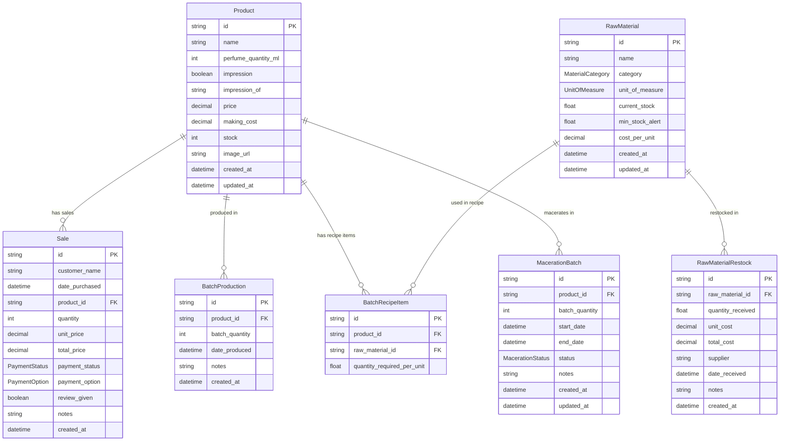

# Database Schema Documentation

## Database Technology: Neon PostgreSQL + Prisma ORM

This document specifies the database models, enums, relationships, and constraints for **Invento**.

Source of truth: [`prisma/schema.prisma`](../prisma/schema.prisma).

---

## 1. Entity Relationship Diagram (ERD)



---

## 2. Enums

### `PaymentStatus`
- `PENDING`: Order logged, payment not yet received.
- `PAYED`: Order payment received in full.
- `REFUNDED`: Order payment refunded to customer.

### `PaymentOption`
- `CASH`: Cash on Delivery / Hand cash.
- `EASYPAISA`: Easypaisa mobile wallet transfer.
- `JAZZCASH`: JazzCash mobile wallet transfer.
- `BANK_TRANSFER`: Direct bank account deposit/IBFT.

### `MaterialCategory`
- `OIL`: Essential / Fragrance oils (measured in ml).
- `SOLVENT`: Perfumer's ethanol / perfumery solvent (measured in ml).
- `BOTTLE`: Glass bottles (measured in pieces).
- `CAP_SPRAY`: Atomizer spray pumps and caps (measured in pieces).
- `STICKER`: Product labels & bottle stickers (measured in pieces).
- `BOX`: Outer packaging boxes (measured in pieces).
- `CARD`: Thank you / notes cards (measured in pieces).
- `OTHER`: Miscellaneous supplies.

### `UnitOfMeasure`
- `ML`: Milliliters
- `GRAMS`: Grams
- `PIECES`: Pieces / Count

### `MacerationStatus`
- `MACERATING`: Batch is aging; not yet in sellable stock.
- `COMPLETED`: Maceration period finished (transitional status; batches awaiting action remain `MACERATING` with a past `end_date` until acted on).
- `ADDED_TO_STOCK`: Batch released — bottles were incremented onto `Product.stock`.

---

## 3. Models Overview

| Model | Purpose | Key behavior |
|-------|---------|--------------|
| `Product` | Finished perfume catalog | `stock` decremented on sale, incremented on production/maceration release; `making_cost` feeds finances |
| `Sale` | Customer order register | Created in a transaction with a stock guard; `total_price = quantity × unit_price` |
| `RawMaterial` | Manufacturing inputs | `current_stock` watched against `min_stock_alert` for low-stock warnings |
| `RawMaterialRestock` | "Got Supply" intake log | Created together with a `current_stock` increment and `cost_per_unit` refresh |
| `BatchProduction` | Production run history | Written by both V1 (`produceBatch`) and V2 (`produceBatchV2`) |
| `BatchRecipeItem` | Per-bottle recipe (V1) | Unique per `(product_id, raw_material_id)`; replaced wholesale on recipe save |
| `MacerationBatch` | Aging batch tracking | Created by V2 production (maceration days > 0) or manually; released to stock via `addMacerationToStock` |

### Relationships & Constraints
- `Sale`, `BatchProduction`, and `MacerationBatch` cascade-delete with their `Product`.
- `RawMaterialRestock` cascade-deletes with its `RawMaterial`.
- `BatchRecipeItem` cascade-deletes with either side (product or raw material).
- Indexes: `Sale(payment_status)`, `Sale(payment_option)`, `Sale(date_purchased)`, `MacerationBatch(status)`, `MacerationBatch(end_date)`.
- `BatchRecipeItem` has a composite unique on `(product_id, raw_material_id)`.

---

## 4. Prisma Schema Code (`prisma/schema.prisma`)

```prisma
datasource db {
  provider = "postgresql"
  url      = env("DATABASE_URL")
}

generator client {
  provider = "prisma-client-js"
}

enum PaymentStatus {
  PENDING
  PAYED
  REFUNDED
}

enum PaymentOption {
  CASH
  EASYPAISA
  JAZZCASH
  BANK_TRANSFER
}

enum MaterialCategory {
  OIL
  SOLVENT
  BOTTLE
  CAP_SPRAY
  STICKER
  BOX
  CARD
  OTHER
}

enum UnitOfMeasure {
  ML
  GRAMS
  PIECES
}

enum MacerationStatus {
  MACERATING
  COMPLETED
  ADDED_TO_STOCK
}

model Product {
  id                  String   @id @default(uuid())
  name                String
  perfume_quantity_ml Int      // Volume in ml (e.g. 30, 50, 100)
  impression          Boolean  @default(false)
  impression_of       String?  // Name of designer scent if impression = true
  price               Float    // Sale price in PKR
  making_cost          Float    @default(0) // Cost to produce one bottle in PKR
  stock               Int      @default(0) // Ready-to-sell bottles
  image_url           String?  // WebP image (base64 data URL)
  created_at          DateTime @default(now())
  updated_at          DateTime @updatedAt

  sales               Sale[]
  batch_productions   BatchProduction[]
  recipe_items        BatchRecipeItem[]
  maceration_batches  MacerationBatch[]

  @@map("products")
}

model Sale {
  id             String        @id @default(uuid())
  customer_name  String
  date_purchased DateTime      @default(now())
  product_id     String
  quantity       Int           @default(1)
  unit_price     Float
  total_price    Float
  payment_status PaymentStatus @default(PENDING)
  payment_option PaymentOption @default(CASH)
  review_given   Boolean       @default(false)
  notes          String?

  created_at     DateTime      @default(now())

  product        Product       @relation(fields: [product_id], references: [id], onDelete: Cascade)

  @@index([payment_status])
  @@index([payment_option])
  @@index([date_purchased])
  @@map("sales")
}

model RawMaterial {
  id              String           @id @default(uuid())
  name            String
  category        MaterialCategory @default(OTHER)
  unit_of_measure UnitOfMeasure    @default(PIECES)
  current_stock   Float            @default(0) // Remaining ml/grams/pcs
  min_stock_alert Float            @default(10) // Threshold warning
  cost_per_unit   Float            @default(0) // Avg cost per unit in PKR
  created_at      DateTime         @default(now())
  updated_at      DateTime         @updatedAt

  restocks        RawMaterialRestock[]
  recipe_items    BatchRecipeItem[]

  @@map("raw_materials")
}

model RawMaterialRestock {
  id                String      @id @default(uuid())
  raw_material_id   String
  quantity_received Float
  unit_cost         Float
  total_cost        Float
  supplier          String?
  date_received     DateTime    @default(now())
  notes             String?

  created_at        DateTime    @default(now())

  raw_material      RawMaterial @relation(fields: [raw_material_id], references: [id], onDelete: Cascade)

  @@map("raw_material_restocks")
}

model BatchProduction {
  id             String   @id @default(uuid())
  product_id     String
  batch_quantity Int      // Number of finished bottles produced
  date_produced  DateTime @default(now())
  notes          String?
  created_at     DateTime @default(now())

  product        Product  @relation(fields: [product_id], references: [id], onDelete: Cascade)

  @@map("batch_productions")
}

model BatchRecipeItem {
  id                         String      @id @default(uuid())
  product_id                 String
  raw_material_id            String
  quantity_required_per_unit Float       // e.g. 15ml oil per bottle

  product                    Product     @relation(fields: [product_id], references: [id], onDelete: Cascade)
  raw_material               RawMaterial @relation(fields: [raw_material_id], references: [id], onDelete: Cascade)

  @@unique([product_id, raw_material_id])
  @@map("batch_recipe_items")
}

model MacerationBatch {
  id                   String            @id @default(uuid())
  product_id           String
  batch_quantity       Int               // Number of bottles in maceration
  start_date           DateTime          // When maceration started
  end_date             DateTime          // When maceration is expected to end
  status               MacerationStatus  @default(MACERATING)
  notes                String?
  created_at           DateTime          @default(now())
  updated_at           DateTime          @updatedAt

  product              Product           @relation(fields: [product_id], references: [id], onDelete: Cascade)

  @@index([status])
  @@index([end_date])
  @@map("maceration_batches")
}
```

---

## 5. Seed Data (`prisma/seed.ts`)

Running `bun run seed` creates:

- **8 raw materials** — French Vanilla & Santal Oud oils, 99% denatured ethanol, 50ml glass bottles, atomizer sprays, logo stickers, packaging boxes, thank-you cards (each with stock, alert threshold, and unit cost).
- **3 products** — Velvet Oud (50ml, impression), Santal Dream (50ml, impression), Midnight Bloom (100ml, original). `making_cost` defaults to `0`.
- **3 sales** — one Payed (Easypaisa), one Pending (JazzCash), one Payed (Bank Transfer).

Recipes and maceration batches are not seeded; define recipes on `/batch-production` and maceration batches on `/maceration` as needed.
