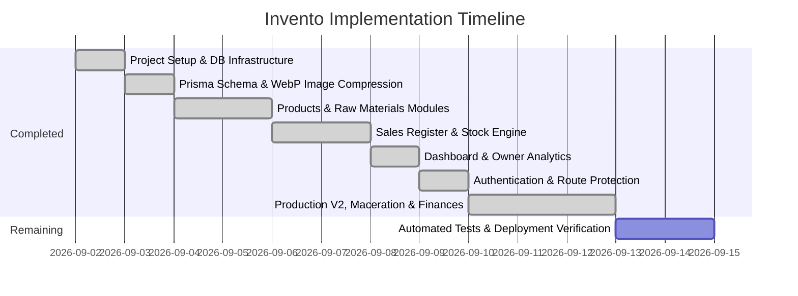

# Implementation & Testing Plan

## Project: Invento (Perfume Brand Inventory & Sales Management)

This document details the development phases, feature milestones, and testing procedures for **Invento**. Phases 1–7 are complete; Phase 8 covers the remaining hardening work.

---

## Development Phases

---

## Detailed Phase Breakdown & Testing Strategy

### Phase 1: Infrastructure & Project Setup ✅
- **Tasks**:
  1. Next.js (App Router) project in TypeScript and Tailwind CSS — later upgraded to **Next.js 16 + React 19 + Tailwind v4**, run on **Bun**.
  2. Core dependencies: `prisma`, `@prisma/client`, `jose`, `lucide-react`, `clsx`, `tailwind-merge`, `@vercel/blob`.
  3. Geist design palette, badge/status styles, and responsive global layout with top + bottom navigation.
- **Testing Plan**:
  - `bun dev` builds clean; Tailwind classes render on mobile and desktop viewports.

### Phase 2: Database Schema & WebP Compression ✅
- **Tasks**:
  1. `prisma/schema.prisma` with `Product`, `Sale`, `RawMaterial`, `RawMaterialRestock`, `BatchProduction`, `BatchRecipeItem`, `MacerationBatch` models and enums (`PaymentStatus`, `PaymentOption`, `MaterialCategory`, `UnitOfMeasure`, `MacerationStatus`).
  2. Prisma singleton client (`lib/prisma.ts`).
  3. Client-side WebP compression helper (`lib/webp-compressor.ts`): resizes photos to ≤ 800×800 and encodes WebP (< 100 KB) before the data URL is saved.
  4. Seed script (`prisma/seed.ts`): 8 raw materials, 3 products, 3 sample sales.
- **Testing Plan**:
  - `bunx prisma validate` — zero schema/relation errors.
  - Compress a 3 MB JPEG and confirm the output is < 100 KB.
  - `bun run seed` populates categories and relations correctly.

### Phase 3: Products Catalog & Raw Materials Hub ✅
- **Tasks**:
  1. **Products Manager (`/products`)**: card grid (image, ml volume, impression tag, price, making cost), add/edit modal with image picker + WebP compression, quick +/- stock steppers, delete with confirmation.
  2. **Raw Materials Hub (`/raw-materials`)**: category filter tabs with counts, low-stock badge (`current_stock <= min_stock_alert`), "Got Supply" restock modal (qty, unit cost, total spend preview, supplier) that increments stock and logs the restock.
- **Testing Plan**:
  - **Products CRUD**: create "Velvet Oud 50ml", edit price/stock, delete — verify DB changes.
  - **Restock Intake**: add +500 ml ethanol at PKR 7,500/unit — `current_stock` +500, `RawMaterialRestock` row created, `cost_per_unit` refreshed.
  - **Low-stock badge** appears exactly when stock crosses the threshold.

### Phase 4: Sales Register & Batch Production Engine ✅
- **Tasks**:
  1. **Sales Register (`/sales`)**: record/edit orders with auto-filled unit price and calculated total; payment status & option filters; inline payment-status dropdown and review toggle; stock deduction with insufficient-stock guard; product-switch stock re-balancing on edit.
  2. **Batch Production V1 (`/batch-production`, legacy)**: recipe management modal (`saveRecipe`), recipe-driven material deduction (`produceBatch`).
  3. **Batch Production V2 (`/batch-production-v2`)**: bottle vs mass modes, concentration-driven oil (g) / ethanol (ml) calculation, optional bottle/box/sticker deduction, live insufficient-stock validation, optional 0–90 day maceration.
- **Testing Plan**:
  - **Stock Auto-Deduction**: sale of 3 bottles drops stock 10 → 7.
  - **Insufficient Stock Guard**: selling 50 when stock is 7 blocks with a clear message.
  - **Edit Re-balancing**: changing quantity/product on a sale restores and re-deducts correctly.
  - **Filter Test**: Easypaisa / PENDING filters return only matching rows; receivables total updates.
  - **V2 Calculation**: 10 bottles × 50ml at 40% → 200 g oil + 300 ml ethanol deducted; shortage in any material blocks submission.

### Phase 5: Owner Dashboard & Analytics ✅
- **Tasks**:
  1. **Dashboard (`/`)**: metric cards (revenue, pending receivables, low-stock products, pending reviews), payment-method breakdown, critical low-stock product list with "Produce Now" link, maceration-complete alerts with Add to Stock / Extend actions, recent sales table, quick actions.
- **Testing Plan**:
  - **Analytics Calculation**: 2 paid sales (PKR 5,000 Easypaisa + 3,000 Cash) and 1 pending (PKR 4,000 Jazzcash) → revenue PKR 8,000, receivables PKR 4,000.

### Phase 6: Authentication & Route Protection ✅
- **Tasks**:
  1. Credential generation script (`scripts/create-user.ts`) producing `AUTH_USERNAME` / `AUTH_PASSWORD_HASH`.
  2. SHA-256 + timing-safe verification, HS256 JWT session cookie via `jose` (`lib/auth.ts`).
  3. Login/logout API routes and the `/login` page.
  4. `proxy.ts` guarding every route (redirect to `/login`, clearing invalid cookies).
- **Testing Plan**:
  - Wrong password rejected; correct password sets cookie and lands on `/`.
  - Unauthenticated request to any protected route redirects to `/login?redirect=…`.
  - Logout clears the cookie and blocks subsequent access.

### Phase 7: Maceration, Finances & Design System ✅
- **Tasks**:
  1. **Maceration (`/maceration`)**: create batches with date ranges, active list with days-remaining/READY badges, add-to-stock and extend actions, completed history; dashboard alert cards.
  2. **Finances (`/finances`)**: revenue / making cost / net profit from paid sales; 65/35 partner split cards and bar.
  3. **Design**: Geist token system in `app/globals.css`, dark mode with pre-paint bootstrap and `ThemeToggle`, favicon/manifest set, `CalendarDatePicker` component.
- **Testing Plan**:
  - **Maceration lifecycle**: create → wait/expire → READY badge → Add to Stock increments product stock exactly once; Extend pushes the end date.
  - **Finances**: with known `making_cost` values, verify revenue − making cost = net profit and the 65/35 split.
  - **Theme**: no light-flash on reload in dark mode; preference persists across sessions.

### Phase 8: Testing Automation & Deployment Verification ⏳
- **Tasks**:
  1. Add an automated test setup (e.g. Vitest + Playwright) covering the transactional server actions (sale stock guard, restock, V2 production, maceration release).
  2. Run `bun run build` — zero TypeScript, App Router, or prerender errors.
  3. Document Vercel deployment steps for `DATABASE_URL`, auth env vars, and (optionally) `BLOB_READ_WRITE_TOKEN`.
  4. Consider migrating product images from data URLs to Vercel Blob storage.
- **Testing Plan**:
  - **Build Integrity**: `bun run build` exits 0 locally.
  - **Environment Variable Test**: server actions fail gracefully with clear guidance when env vars are missing.
  - **Deployment Smoke Test**: login → record sale → produce batch → release maceration on the live URL.

---

## Manual Regression Checklist (release gate)

1. Login / logout / blocked-route redirect.
2. Product create/edit/delete + image compression + stock steppers.
3. Sale create/edit with stock guards, filters, status & review toggles.
4. Raw material create/edit/delete + restock intake + low-stock badges.
5. V1 recipe save/produce; V2 bottle & mass modes with and without maceration.
6. Maceration create → release / extend; dashboard alerts.
7. Dashboard & finances figures reconcile with seeded/test data.
8. Dark mode + mobile bottom navigation on a phone viewport.
