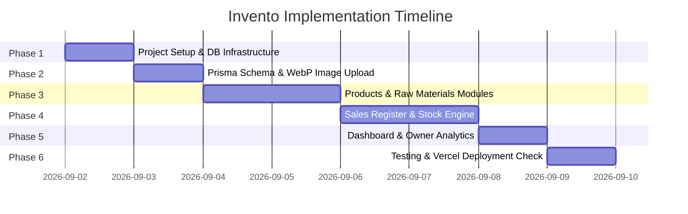

# Implementation & Testing Plan

## Project: Invento (Perfume Brand Inventory & Sales Management)

This document details the step-by-step development phases, feature milestones, and testing procedures for building **Invento**.

---

## Development Phases

---

## Detailed Phase Breakdown & Testing Strategy

### Phase 1: Infrastructure & Project Setup
- **Tasks**:
  1. Initialize Next.js 14/15 App Router project in `g:\Projects\invento\` with TypeScript and Tailwind CSS.
  2. Install core dependencies: `prisma`, `@prisma/client`, `@vercel/blob`, `lucide-react`, `clsx`, `tailwind-merge`.
  3. Configure Tailwind color palette, badged statuses, and global layout with responsive navigation.
- **Testing Plan**:
  - Run `npm run dev` to verify Next.js builds clean locally.
  - Verify Tailwind CSS classes render correctly on mobile and desktop viewports.

---

### Phase 2: Database Schema & WebP Upload Engine
- **Tasks**:
  1. Create `prisma/schema.prisma` with `Product`, `Sale`, `RawMaterial`, `RawMaterialRestock`, `BatchProduction`, `BatchRecipeItem` models and enums (`PaymentStatus`, `PaymentOption`, `MaterialCategory`, `UnitOfMeasure`).
  2. Setup Prisma singleton client (`lib/prisma.ts`).
  3. Create client/server WebP image compression helper (`lib/webp-compressor.ts`) that resizes raw photos (e.g. 5MB JPGs) into WebP images (< 100KB) before uploading to Vercel Blob.
  4. Create seed script (`prisma/seed.ts`) with sample raw materials (Vanilla Oil, 99% Ethanol, 50ml Glass Bottle, Logo Sticker, Branded Box, Thank You Card).
- **Testing Plan**:
  - **Prisma Validation Test**: Execute `npx prisma validate` to confirm zero schema syntax or relation errors.
  - **WebP Compression Test**: Test converting a 3MB JPEG file into `.webp` and verify output file size is < 100 KB.
  - **Seed Test**: Run `npx prisma db seed` (or mock seed execution) to verify raw material categories populate correctly.

---

### Phase 3: Products Catalog & Raw Materials Hub
- **Tasks**:
  1. **Products Manager (`/products`)**:
     - Product Cards grid showing image, perfume ml volume, impression tag, unit price, stock count.
     - Add/Edit Perfume Modal with image picker, WebP compressor, volume input, and price.
  2. **Raw Materials Hub (`/raw-materials`)**:
     - Categorized inventory tables (Fragrance Oils, Ethanol, Bottles, Atomizer Sprays, Stickers, Boxes, Cards).
     - Low stock alert badge indicators when `current_stock <= min_stock_alert`.
     - **"Got Supply" Restock Intake Modal**: Record raw material arrivals (Qty, Total Cost, Supplier), automatically incrementing `current_stock`.
- **Testing Plan**:
  - **Products CRUD Test**: Create a product "Velvet Oud 50ml", edit stock level, and delete product. Verify database reflects changes.
  - **Restock Intake Test**: Add +500 ml of "Ethanol 99%" with cost PKR 7,500. Verify `current_stock` increases by 500 and a `RawMaterialRestock` record is created.

---

### Phase 4: Sales Register & Batch Production Engine
- **Tasks**:
  1. **Sales Register (`/sales`)**:
     - Customer Order Entry Modal (Customer Name, Date, Product Select, Quantity, Payment Status, Payment Option, Review Given toggle).
     - Auto-Calculate Total Price (`quantity * unit_price`).
     - Automated Stock Deduction: Decrements ready-to-sell `Product.stock` when order is recorded.
     - Filter sales table by Payment Status (`PENDING`, `PAYED`, `REFUNDED`) and Payment Option (`CASH`, `EASYPAISA`, `JAZZCASH`, `BANK_TRANSFER`).
  2. **Batch Production Engine (`/batch-production` / Raw Materials tab)**:
     - Produce Batch Modal: Select perfume product and batch quantity (e.g. 20 bottles).
     - Auto-deduct required raw materials (oil, ethanol, bottle, sticker, box) based on recipe, and increment finished product stock.
- **Testing Plan**:
  - **Stock Auto-Deduction Test**: Create a sale of 3 bottles of "Velvet Oud". Verify product stock decreases from 10 to 7 automatically.
  - **Insufficient Stock Guard Test**: Attempt to record a sale for 50 bottles when stock is 7. Verify transaction blocks with user-friendly warning.
  - **Payment Method Filter Test**: Select "Easypaisa" filter. Verify only Easypaisa sales appear in table.
  - **Pending Payment Tracker Test**: Filter by "PENDING". Verify total pending receivables balance updates correctly.

---

### Phase 5: Owner Dashboard & Analytics
- **Tasks**:
  1. **Dashboard Home (`/`)**:
     - Metric Cards: Total Revenue (PKR), Pending Receivables (PKR), Total Sales Count, Low Stock Warnings Count.
     - Payment Method Breakdown Chart/Cards (Cash vs Easypaisa vs Jazzcash vs Bank Transfer).
     - Quick Action Buttons: "New Sale", "Got Supply", "New Perfume".
     - Pending Reviews Watchlist (List of customers who haven't given a review yet).
- **Testing Plan**:
  - **Analytics Calculation Test**: Create 2 Paid sales (PKR 5,000 via Easypaisa, PKR 3,000 via Cash) and 1 Pending sale (PKR 4,000 via Jazzcash). Verify Total Revenue displays PKR 8,000 and Pending Receivables displays PKR 4,000.

---

### Phase 6: Vercel Deployment & Build Verification
- **Tasks**:
  1. Run `npm run build` to verify zero TypeScript, Next.js App Router, or prerender errors.
  2. Create Vercel Deployment documentation with step-by-step setup for Neon `DATABASE_URL` and `BLOB_READ_WRITE_TOKEN`.
- **Testing Plan**:
  - **Build Integrity Test**: Run `npm run build` locally and ensure exit code 0.
  - **Environment Variables Test**: Verify all server actions gracefully handle missing environment variables with clear guidance.
